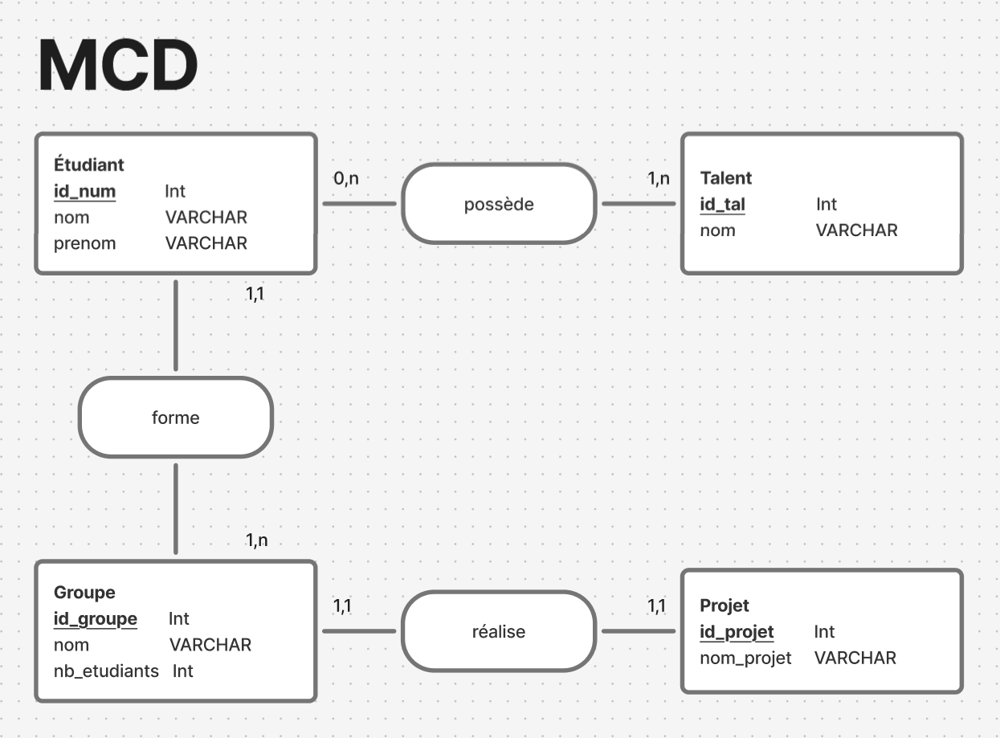

# IMAC1-S2-Workshop-Archi-Web
---

### Organisation
- Nom du groupe : C.L.E
- Membres : Emilie DESOMBRE, Chanaël SIAR, Léo SUY
- Chef de projet : Léo SUY

### Description du projet
Ce projet consiste à développer un site web relié à un serveur, permettant d’afficher une liste d’étudiants, leurs points forts (développement, montage, musique, dessin, etc.), les groupes auxquels ils appartiennent, ainsi que les projets sur lesquels ils travaillent.

L’objectif principal est de créer une plateforme centralisée pour recenser les talents de chaque étudiant. Grâce à cette base de données, il sera possible de constituer des groupes de travail équilibrés et complémentaires en fonction des compétences de chacun. Chaque groupe pourra alors être associé à un projet, avec une fiche récapitulative listant les membres et les atouts de l’équipe.

Le site offrira plusieurs fonctionnalités clés :

- Ajout, modification et suppression de profils étudiants et de leurs compétences.
- Affichage des étudiants, de leurs points forts et des projets en cours.
- Affichage et gestion de groupes en fonction des compétences disponibles.
- Association de groupes à des projets avec suivi des membres impliqués.

Ce système vise à faciliter la gestion de projets collaboratifs dans un cadre pédagogique tout en valorisant les compétences individuelles.

**Réalisé dans le cadre du Workshop d'Architecture Logicielle Web du semestre 2 de la première année d'IMAC (2024-2025).**

---
## Schéma Conceptuel de la Base de Données

